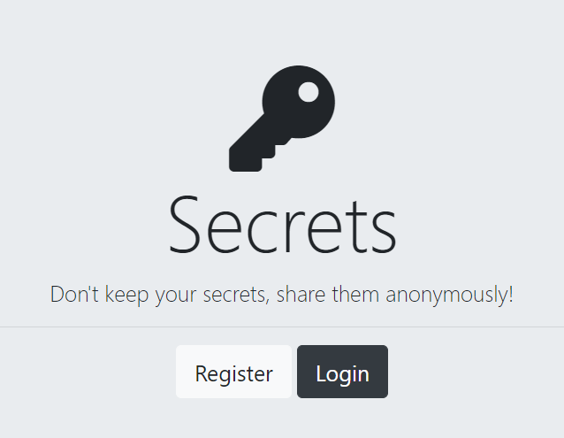
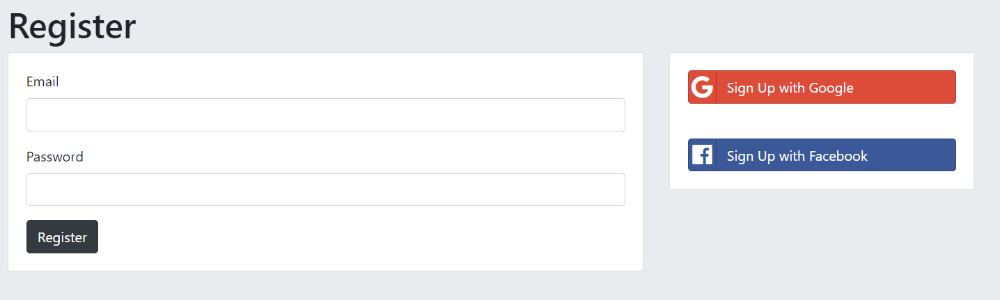
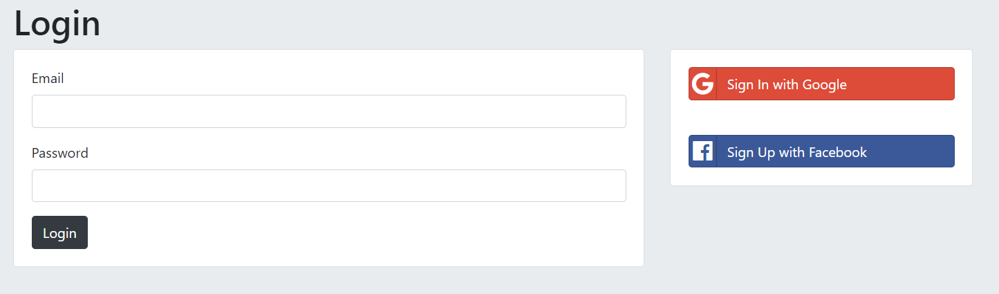
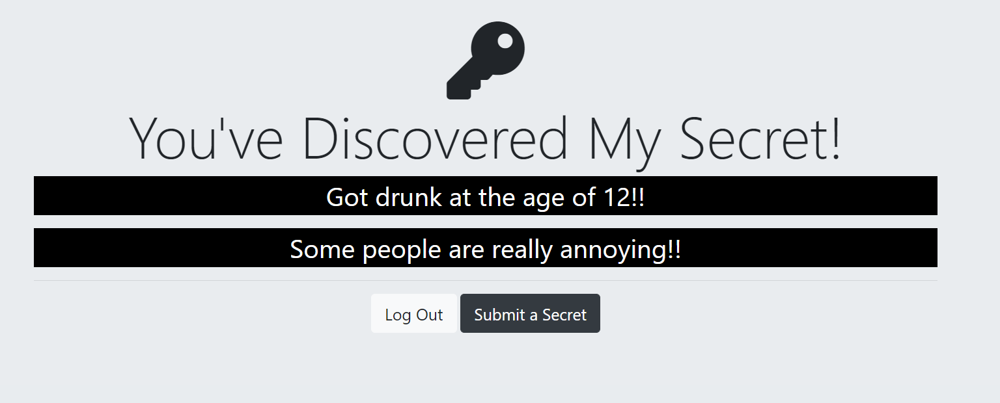

# Authentication-Secrets

To inspect the code for the module, you can clone this repository and use git checkout to see the completed code for each lesson. If you don't remember how to do this, be sure to revisit the Git and GitHub module.
Tech Stack Used -
1) HTML
2) CSS
3) JavaScript
4) Node.js
5) Express.js
6) React.js
7) Mongo DB
8) OAuth Authentication
9) Passport.js( NPM Package)
10) Code Sandbox

# Idea
Many people today want to comment something or say something online without revealing their identity.

Secrets app is an initiative where people can post about anything anonynously

Users can also see other people's comments which are anonymous as well

# Prerequisite

Download, install and setup Node.js

Download, install and setup MongoDB and Robo3T

Install Nodemon (optional)

# Setup

User needs to Clone the repo using git clone to their local repo

Now, open gitbash or any other terminal and navigate to the project folder

Next step is to install the node modules using the command npm install

When the modules are installed, type node app.js. User can also type nodemon app.js if they have nodemon installed

Running the command will set up our server and the user can see the message - "Server has started running successfully"

# Screenshots
### Home Page

### Register Page

### Login Page

### Page

